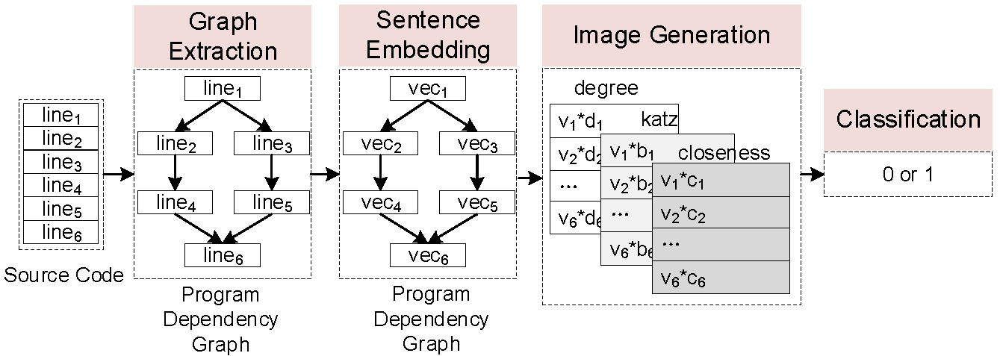

## VulCNN: An Image-inspired Scalable Vulnerability Detection System

Since deep learning (DL) can automatically learn features from
source code, it has been widely used to detect source code vulnerability. To achieve scalable vulnerability scanning, some prior studies intend to process the source code directly by treating them as
text. To achieve accurate vulnerability detection, other approaches
consider distilling the program semantics into graph representations and using them to detect vulnerability. In practice, text-based
techniques are scalable but not accurate due to the lack of program
semantics. Graph-based methods are accurate but not scalable since
graph analysis is typically time-consuming.

In this paper, we aim to achieve both scalability and accuracy on
scanning large-scale source code vulnerabilities. Inspired by existing DL-based image classification which has the ability to analyze
millions of images accurately, we prefer to use these techniques
to accomplish our purpose. Specifically, we propose a novel idea
that can efficiently convert the source code of a function into an
image while preserving the program details. We implement VulCNN and evaluate it on a dataset of 13,687 vulnerable functions and
26,970 non-vulnerable functions. Experimental results report that
VulCNN can achieve better accuracy than eight state-of-the-art vulnerability detectors (i.e., Checkmarx, FlawFinder, RATS, TokenCNN,
VulDeePecker, SySeVR, VulDeeLocator, and Devign). As for scalability,
VulCNN is about four times faster than VulDeePecker and SySeVR,
about 15 times faster than VulDeeLocator, and about six times faster
than Devign. Furthermore, we conduct a case study on more than 25 million lines of code and the result indicates that VulCNN can
detect large-scale vulnerability. Through the scanning reports, we
finally discover 73 vulnerabilities that are not reported in NVD.

## Design of VulCNN

VulCNN consists of four main phases:
Graph Extraction, Sentence Embedding, Image Generation, and
Classification.
1. Graph Extraction: Given the source code of a function,
we first normalize them and then perform static analysis to
extract the program dependency graph of the function.
2. Sentence Embedding: Each node in the program depen-
dency graph corresponds to a line of code in the function.
We regard a line of code as a sentence and embed them into
a vector.
3. Image Generation: After sentence embedding, we apply
centrality analysis to obtain the importance of all lines of code and multiply them by the vectors one by one. The
output of this phase is an image.
4. Classification: Our final phase focuses on classification.
Given generated images, we first train a CNN model and
then use it to detect vulnerability.

## Dataset
We first collect a dataset from Software Assurance Reference Dataset
(SARD) ( https://samate.nist.gov/SRD/index.php) which is a project maintained by National Institute
of Standards and Technology (NIST) (https://www.nist.gov/). SARD contains a large
number of production, synthetic, and academic security flaws or vulnerabilities (i.e., bad functions) and many good functions. In our
paper, we focus on detecting vulnerability in C/C++, therefore, we
only select functions written in C/C++ in SARD. Data obtained
from SARD consists of 12,303 vulnerable functions and 21,057
non-vulnerable functions. Moreover, since the synthetic programs
in SARD may not be realistic, we collect another dataset from
real-world software. For real-world vulnerabilities, we consider
National Vulnerability Database (NVD) (https://nvd.nist.gov) as our collection
source. We finally obtain 1,384 vulnerable functions that belong to
different open-source software written in C/C++. For real-world
non-vulnerable functions, we randomly select a part of the dataset
in [42] which contains non-vulnerable functions from several open-
source projects. Our final dataset consists of 13,687 vulnerable
functions and 26,970 non-vulnerable functions.

## Publication
Yueming Wu, Deqing Zou, Shihan Dou, Wei Yang, Duo Xu, and Hai Jin.
2022. VulCNN: An Image-inspired Scalable Vulnerability Detection System.
In 44th International Conference on Software Engineering (ICSE ’22), May
21–29, 2022, Pittsburgh, PA, USA. ACM, New York, NY, USA, 12 pages. https://doi.org/10.1145/3510003.3510229
